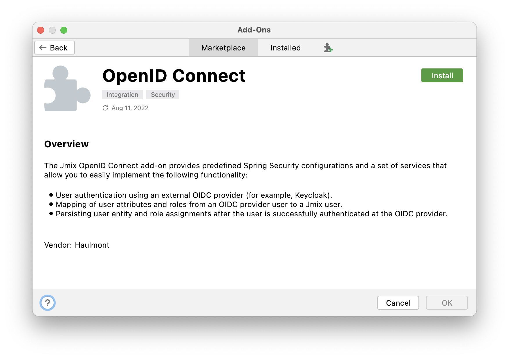

  

Jmix Petclinic is an example application built with Jmix framework. It is based on the commonly known [Spring Petclinic](https://github.com/spring-projects/spring-petclinic) example.

## SSO with AUth0

